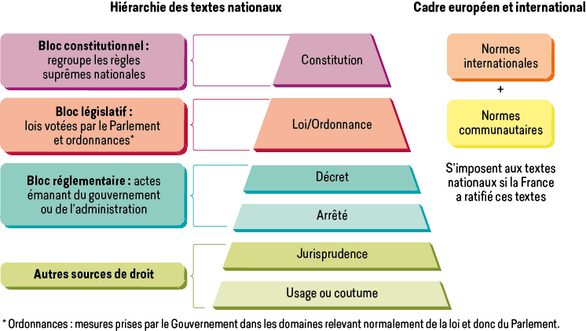

## Introduction : la hiérarchie des normes

<iframe width="560" height="315" src="https://www.youtube.com/embed/GfnKO5VpNoA?si=OnVM35wEFkTZqMPA" title="YouTube video player" frameborder="0" allow="accelerometer; autoplay; clipboard-write; encrypted-media; gyroscope; picture-in-picture; web-share" allowfullscreen></iframe>